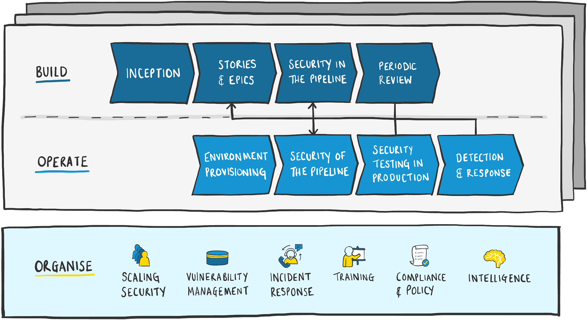

# Untitled

## Introduction

This playbook defines a set of principles and practices that Equal Experts recommends for delivery of secure software. Our approach is based on a combination of first-hand experience and industry best practice.

We hold a similar view to that of the [AWS Well-Architected Framework](https://aws.amazon.com/architecture/well-architected/) \(emphasis added\):

_... we prefer to distribute capabilities into teams rather than having a centralized team with that capability. There are risks when you choose to distribute decision making authority, for example, ensuring that teams are meeting internal standards. We mitigate these risks in two ways. First,_ _**we have practices that focus on enabling each team to have that capability**, and_ _**we provide access to experts who ensure that teams raise the bar on the standards they need to meet**. Second,_ _**we put in place mechanisms that carry out automated checks to ensure standards are being met**._

The practices defined are technology and vendor agnostic, allowing each team to determine the best way to adopt them in their specific context.

### Who’s this playbook for?

We’ve created this playbook to help teams work together to deliver secure software. It’s not just for software engineers; it is for everyone involved in delivering software. It’s also not prescriptive about how each of the practices should be adopted, but allows you to determine which practices are appropriate for you and the best way to implement them.

### How is this different to… ?

The practices in this playbook have focused on ensuring the important principles are achieved without being too low level or prescriptive. This ensures they can be applied across a wide range of environments and technologies, and are more resilient to the changes in the way we deliver and operate software. We have avoided using a scoring system, which can be manipulated or become the objective, so that the focus is on secure software.

We have outlined other well known resources and how this playbook differs from each of them.

#### Secure coding standards

We’ve deliberately used the term ‘Secure Delivery’ because software security encompasses a lot more than just writing code. Addressing coding standards without considering delivery in its wider context would be failing to address security overall. It would also fail to emphasise the importance of every individual, regardless of role, in the delivery of secure software. Elements of this playbook can be used to inform secure coding standards, but we advise against using secure coding standards in isolation.

#### OWASP SAMM and BSIMM

Both [OWASP SAMM](https://www.owasp.org/index.php/OWASP_SAMM_Project) and [BSIMM](https://www.bsimm.com/) are maturity models that allow you to measure the maturity of your organisation against a set of practices. While SAMM provides a set of community-curated practices, BSIMM practices are derived from an annual industry survey. SAMM is measuring maturity against a prescriptive set of practices whereas BSIMM allows you to measure the maturity of your organisation relative to its peers.

The Secure Delivery Playbook is not intended to be a maturity model. While SAMM “defines three maturity levels as objectives” for each practice, we don’t believe a ‘maturity score’ should be the objective. It’s easy to manipulate scoring systems and demonstrate ‘maturity’ while still being insecure. Instead, our objective is to deliver secure software. The practices exist only to facilitate the delivery of secure software - they’re not valuable in and of themselves.

#### OWASP ASVS and Proactive Controls

The [OWASP ASVS](https://github.com/OWASP/ASVS) provides a comprehensive set of potential security requirements that can be used in building software, and can be very helpful either as a starting point for defining your own requirements or for validating whether you’ve identified all the appropriate requirements for your product.

The [OWASP](https://www.owasp.org/index.php/OWASP_Proactive_Controls) [Proactive Controls](https://www.owasp.org/index.php/OWASP_Proactive_Controls) lists a combination of controls and techniques that should be applied in every software project. This is somewhere in between the ASVS and the Secure Delivery Playbook, as it does describe techniques or practices you can adopt but also describes controls you should implement. It’s unclear why the list is limited to ten items, other than perhaps to align to the [OWASP Top 10](https://www.owasp.org/index.php/Category:OWASP_Top_Ten_Project) project.

The Secure Delivery Playbook does not attempt to provide a prescriptive low level of detail, but instead acts as a guide for delivery practices you should consider adopting to deliver secure software. We have however, referenced the ASVS as a valuable source of information when defining security requirements, and we see this as complementary to the playbook.

#### Core Infrastructure Initiative Best Practices

The [Linux Foundation Core Infrastructure Initiative Best Practices](https://bestpractices.coreinfrastructure.org/en) project has defined a set of criteria for open source projects to demonstrate that they’re following best practice. Many of the criteria don’t necessarily apply to internal corporate projects, but others are more generally applicable.

We’ve found resources like this to be helpful for determining whether the practices we adopt are inline with industry norms, and whether new practices have emerged that we should consider including in our own projects.

However, the Secure Delivery Playbook is not a scoring system and will not earn you an independently verifiable badge. We choose not to be prescriptive, but instead to provide guidance that allows teams to select which practices are most suitable in their context. This also ensures teams think about the practices critically and with an eye on business value, rather than being influenced to achieve a silver or gold badge.

### Security Engineers and Security Champions

In this playbook we refer to both Security Engineers and Security Champions. These are quite different roles but the distinction may be unclear to you if you’ve not heard of them before. We explain below what each of these roles looks like and the kind of skills required to be successful in them.

#### Security Engineer

The best security engineers are software security people, but software security people are often impossible to find. When you need to grow the number of security engineers in your organisation by developing existing people, start with developers and teach them about security. Starting with network security people and attempting to teach them about software, compilers, SDLCs, bug tracking, and everything else in the software universe usually fails to produce the desired results. Unfortunately, no amount of traditional security knowledge can overcome a lack of experience building software.

Security engineers come in a variety of shapes and sizes. All good security engineering teams include both people with deep coding experience and people with architectural experience. Software security can’t only be about finding specific bugs such as the OWASP Top Ten. Code review is an important best practice, and to perform code review you must actually understand code \(not to mention the huge piles of security bugs\). However, the best code reviewers sometimes make poor software architects, and asking them to perform an architecture risk analysis will only result in blank stares. Make sure you cover architectural capabilities in your security engineering team in the same way that you cover code. Finally, a security engineer is often asked to mentor, train, and work directly with hundreds of developers. Communications skills, teaching capability, and consulting practical knowledge are must-haves for at least a portion of the security engineering team.[\[1\]]()

#### Security Champions

Security Champions are essential to scale security effectively. The ratio of security specialists to developers tends to be very low; it’s not unusual to operate on a ratio of 1:100 or less. To be effective, we can’t rely on a central team for all security activity, and we must empower delivery teams to own the security of their own products in a meaningful way. Security Champions are widely recognised as the best solution to this problem.

To quote [Mozilla](https://wiki.mozilla.org/Security/Champions):

* Security Champions are active members of a team that make help to make decisions about when to engage the Security Team
* Act as the “voice” of security for the given product or team
* Assist in the triage of security bugs for their team or area

## Principles

Delivering secure software is about a lot more than just writing secure code. Security is not a product that can be purchased after development is complete, or a set of features that can be easily added on later: it’s an integral part of everything we build, balanced by risk.

The following principles guide our everyday work and are the foundation of the practices we adopt.

### Principle 1: Good Security is Collaborative

[We deliver as a team of equals](https://www.equalexperts.com/our-people/our-values/). While we may work on a relatively small delivery team, we recognise that we play an important part of a much bigger team that has collective responsibility to the organisation. We must remember that the whole product delivery team is accountable and responsible for the software they create, while receiving support from Security Engineering. Security is not exclusively a technology problem; it requires cooperation and collaboration across disciplines, including product, engineering, security and other stakeholders.

A successful software security initiative depends on strong collaboration between everyone involved, including Security Engineering, product and delivery teams, together with support from senior management.

_“Security is everyone’s job now, not just the security team’s. With continuous integration and continuous deployment, all developers have to be security engineers, we move too fast for there to be time for reviews by the security team beforehand.”_

_- Werner Vogels \(CTO, Amazon\)_

### Principle 2: Good Security is Continuous

In order to be effective, security should be a consideration during all activities involved in delivery, including:

* Inception
* Requirements gathering
* Architecture and design
* Development
* Testing
* Deployment
* Operations
* Decommissioning

This means that we consider the security implications of the work we’re doing throughout delivery, rather than leaving it to the end. [We practice constant verification, not wishful thinking](https://www.equalexperts.com/our-people/our-values/?=1). Applied to security, this means we build security in right from the start with tests to verify the quality of what we’ve delivered; we don’t wait for a penetration test or security review just before release and hope for the best. We take steps to ensure that - as much as is possible - every iteration of the software is subject to the right level of security review, enabling the continuous delivery of secure software that creates value as early as possible. We aim to have completed all relevant security testing by the point that a feature is functionally ready for deployment.

### Principle 3: Good Security is Contextual

Security is a response to risks faced by the organisation. This means we must first understand those risks in order to respond appropriately. These risks can impact an organisation in many ways, such as:

* Reduction in profitability \(either through direct customer loss, or failure to win new customers\)
* Reputational damage
* Financial damage \(regulatory fines or compensation of affected users\)
* Regulatory non-compliance
* Data / system compromise
* Availability

We balance the need for security to reduce risk alongside other organisational needs, such as:

* Feature delivery
* Performance
* Operability
* Usability
* Accessibility

This doesn’t mean we satisfy one organisational need at the expense of the others. It means we find the best balance of all of the competing priorities in order to deliver the most suitable product for the organisation. Where we recommend or implement a tradeoff, the process by which we arrived at this is made clear so that the organisation is aware of the risks and expected impact.

### Principle 4: Good Security is Cumulative

Security is best achieved in layers. Don’t rely on a single practice or tool to meet all your security needs, but instead adopt multiple complementary practices and tools to provide layers of protection.

This ensures that if a single tool or process fails to identify a vulnerability, or a single control fails, there will be other layers of security to avoid compromise. No single tool, process or control provides complete security, which is why the cumulative effect of multiple layers of security is paramount.

## Practices

The practices in this guide have been divided into three areas: Organise, Build & Operate.

**Organise** practices are owned by Security Engineering and provide a wider view of security across the organisation. They do this by providing specialist expertise and services that can be consumed by the rest of the organisation.

**Build** and **Operate** practices are owned by the product delivery team and focus on security activities during development and live operations of the product.

### Where do I start?

The best approach is to start with the practices that have high impact and low effort.

**Impact:** To understand the impact of a practice, we need a high level view of the context of the product. This includes: what value the product brings to the company, the sensitivity of data the product handles, the impact of a breach or compromise to the product and any regulatory requirements that must be met.

**Effort:** To understand the effort of a practice, we must understand the context of the product delivery. This includes: the technologies used in the product, the delivery team’s skill and experience, the level of automation in the deployment pipeline and other teams involved in the delivery process \(i.e. change control\).

The best approach is to deliver the practices in the smallest possible incremental steps that provide immediate feedback. This approach provides immediate measurable value and is also useful to build confidence and demonstrate how improvements can be easily delivered without large expense.

### Organise

#### Scaling Security

**Embed Security Champions in all teams**

[Security Champions](https://wiki.mozilla.org/Security/Champions) are widely recognised as the most effective way to scale security. While remaining primarily skilled as developers, testers, architects, business analysts, etc., they act as a voice for security within a team and bring a foundational knowledge of security into daily discussions. They identify when more expertise is required and engage with Security Engineering.

All teams should have a Security Champion who regularly interacts with Security Engineering and ensures the team receives the support they need to meet security needs.

**Co-locate technical security specialists alongside delivery teams**

Working from the same physical location can confer advantages that are hard to replicate remotely. While we value the flexibility we get from communications tools like Slack, having technical security specialists physically present brings significant benefits. It allows them to get hands on, pairing with developers and testers or running threat modelling sessions increases their impact substantially and often reduces the time to resolve critical issues. It also has a very positive effect on the relationship between Security Engineering and delivery teams.

When an engagement spans multiple locations, technical security specialists should be available to meet delivery teams in person wherever possible.

#### Vulnerability Management

**Monitor published vulnerabilities in third party products**

Vulnerabilities in third party products or libraries are a significant risk to organisations. A Security Engineering Team should actively monitor relevant vulnerability databases for newly discovered / published vulnerabilities and alert the impacted delivery teams of new risks.

It should also actively monitor a wide range of public vulnerability data sources \(e.g. using a threat intelligence feed\) to gain early warning of any new vulnerabilities that might impact the organisation. Automated tooling is available to enable the matching of the data against any software used / developed by the organisation.

**Introduce a vulnerability remediation process**

In order to respond to identified vulnerabilities effectively, a process should be put in place to help teams understand the steps that should be taken and where they can go for help. Risk assessment forms an important part of this process as it helps determine how best to respond. It can be helpful to model the impact of previous relevant incidents within the organisation, including product stakeholders in this process, and also drawing on threat intelligence on the wider industry. Many organisations and standards bodies have produced guides and standards that can aid this process.

* [Factor Analysis of Information Risk \(FAIR\)](https://www.fairinstitute.org/)
* [Mozilla Rapid Risk Assessment \(RRA\)](https://infosec.mozilla.org/guidelines/risk/rapid_risk_assessment.html)
* [Common Vulnerability Scoring System \(CVSS\)](https://www.first.org/cvss/specification-document)
* [OWASP Risk Rating Methodology](https://www.owasp.org/index.php/OWASP_Risk_Rating_Methodology)
* [DREAD](https://en.wikipedia.org/wiki/DREAD_%28risk_assessment_model%29)
* [MITRE ATT&CK](https://attack.mitre.org/)

**Promote visibility and transparency**

In some organisations, security is kept behind closed doors and not readily shared with delivery teams. This leads to a complicated relationship between security and delivery, as delivery teams aren’t given sufficient information to adequately address security issues. A common example of this problem is when security logs are sent to a separate SIEM \(Security Information and Event Management\) tool that isn’t made available to the teams that are responsible for the software being monitored.

Security engineers should work openly and collaboratively with delivery teams at all times, ensuring that security logs and metrics are visible to everyone involved in delivery. This can be achieved through dashboards in observability tools and sharing access to all security operations data in real time with delivery teams. After every incident, a blameless post-mortem should be conducted \(including all relevant representatives\) to identify areas for improvement. These improvements should be shared with the rest of the organisation to ensure it also benefits.

**Encourage effective use of penetration testing**

Penetration testing is an opportunity to identify security issues. It’s most effective when the testing is goal focused \(i.e. steal sensitive data\) and the tester works in conjunction with the team, explaining issues as they’re discovered and providing recommendations on how to fix the issue. This gives the opportunity for the team to fix some issues during the penetration test, and ensures that the final report is well understood. It is least effective when only a vulnerability scan is performed, as that could be automated in the delivery pipeline instead.

Penetration testing is a useful indicator of the success of the practices in Build & Operate.

**Manage external security researchers & bug bounties**

Some organisations operate bug bounty schemes to encourage independent security researchers to help identify and fix security issues. Regardless of whether you operate a bug bounty, external security researchers expect all companies to provide a well signposted security contact where they can disclose vulnerabilities they’ve discovered.

Poor handling of disclosed vulnerabilities can lead to uncontrolled public disclosure and bad publicity. Good handling of this can lead to substantial security improvements at a very low cost. That’s why organisations need to cultivate good relationships with security researchers, ensuring they’re paid promptly, kept informed and not treated with suspicion. Publishing a vulnerability disclosure policy so that security researchers have clear expectations about the disclosure process can be helpful.

Examples:

* [HackerOne](https://www.hackerone.com/)
* [Bugcrowd](https://www.bugcrowd.com/)
* [Security.txt](https://securitytxt.org/)

**Evaluate third party vendor / product security**

Most organisations require a formal security evaluation before adopting new products or technologies. To do this, it needs technical security expertise to identify risks within the product and any supporting processes \(e.g. not just the technical implementation of the product, but also the way the vendor handles security issues and their expertise in security\).

Security Engineering should be actively involved in evaluating any third party suppliers & products. This should not be seen as a yes/no assessment, but rather as a way to highlight potential weaknesses and recommend approaches to mitigate that risk.

#### Incident Response

**Plan and rehearse incident response activities**

Every organisation should have a comprehensive approach to incident response so that it can be ready when something goes wrong. Modern data protection laws and regulations also require an active approach to incident response \(i.e. breach detection and notification requirements in GDPR\). For incident response plans to be valuable they need to be regularly tested, including all parts of the organisation, to ensure the organisation as a whole is able to respond under pressure. For example, GDPR gives only 72 hours to determine whether a breach should be reported to the ICO \(Information Commissioner’s Office\).

Security Engineers should be actively involved in defining the incident response plans and following these plans when an incident occurs. The incident response plans must be tested and rehearsed to ensure they address the risk faced by the organisation adequately. This can be achieved through approaches such as tabletop exercises, chaos engineering, and red/blue or purple team exercises that allow teams to identify how they respond under pressure in critical situations. The Security Engineering team must involve stakeholders across the organisation \(e.g. customer relations, PR, legal, engineering, etc.\) to ensure all parties know their role and are ready to assist when required.

Links:

* [PagerDuty IR Checklist](https://response.pagerduty.com/during/security_incident_response/)

**Collaborate on active security incidents**

When a security incident arises, teams across the organisation should collaborate openly and share information to ensure the incident is responded to quickly and effectively. When this is centrally managed by a single team \(e.g. Security Engineering\) and there is no engagement with the delivery team, the effectiveness of the response is reduced and the time to resolve the incident is increased.

Engaging the delivery team is an important opportunity to learn and improve the security of future product delivery. We should use blameless post-mortems to share learnings more widely within the organisation. A culture of open information sharing around security incidents will lead to greater risk reduction to the organisation, as teams are better informed and motivated to avoid similar incidents in the future.

#### Training

**Provide role-specific training**

Each individual on a delivery team has a part to play, and should understand how security applies in their context. Although it may appear that security training should be focused on software engineers, it’s important to provide training for all roles in a team including developer / engineering, BAs, POs, DLs, etc. For example, a Product Owner should understand the risk that the product is exposed to without appropriate security controls, and should be empowered to challenge security requirements that are not well defined.

Examples:

* [Hacksplaining](https://www.hacksplaining.com/)
* [Immersive Labs](https://www.immersivelabs.com/)
* [Security Journey](https://www.securityjourney.com/)
* [Secure Code Warrior](https://securecodewarrior.com/)

**Provide specialist consulting to teams**

Delivery teams don’t always have the experience or skills required to address more specialist areas of security. This leads to suboptimal solutions or increased risk or complexity. Security Engineering should provide specialists in order to assist delivery teams when the team lacks the skills to complete a particular feature \(for example when implementing features that require cryptography\).

Security Engineering should also be available to conduct or facilitate threat modelling sessions, and use this as an opportunity to teach this skill to others.

#### Compliance & Policy

**Understand compliance context**

It’s important to understand where compliance requirements originate from so that appropriate controls can be put in place. Excessive controls can negatively impact productivity or encourage teams to work around them in order to complete their work. It can also increase time to market and overall cost of delivery. Insufficient controls can leave the organisation exposed to risk, potentially resulting in fines or other sanctions from regulators. Therefore it’s critical to ensure that the principles behind the compliance requirements are well understood so that they can be efficiently adapted to the organisation.

**Enforce policy as code**

Wherever possible, policies should be written as code that is executed automatically. This applies to both software development \(e.g. preventing deployment of an application containing a critical vulnerability\) and infrastructure \(e.g. detecting policy violations such as public S3 buckets\). The use of automated tools allows a good balance between delivery team productivity and policy compliance. Automated tools allow the Security Engineering team to scale as delivery teams can implement and execute policy compliance on a regular basis without individual compliance audits.

Examples of automated tooling include:

* [Inspec](https://www.inspec.io/)
* [Forseti Security](https://forsetisecurity.org/)
* [Sysdig Falco](https://sysdig.com/opensource/falco/) \([Sysdig Secure](https://sysdig.com/products/secure/)\)
* [Turbot](https://turbot.com/)
* [Datree](https://datree.io/)
* [Open Policy Agent](https://www.openpolicyagent.org/)

#### Intelligence

**Make security visible in the software catalogue**

The organisation should provide a central view of all software products they create, including relevant metadata \(e.g. owning team, deployed versions, links to operability dashboards, source repo, build jobs, etc.\). This should be automatically kept up to date, preferably by pulling the information directly from the relevant systems \(e.g. GitHub, Jenkins, Grafana, Kibana, deployment tooling, etc.\).

Security Engineering should ensure that security tooling is integrated with the software catalogue or inventory so that teams can be easily informed of the security issues in their services and understand the issues they are accountable for. This also provides a high-level view of where the greatest risk is and which projects need more assistance from Security Engineering.

**Conduct a post-mortem after security incidents**

Security Engineering should ensure that blameless post-mortems are conducted after every security incident, involving representatives across the organisation. A post-mortem is a written record of an incident, its impact, the actions taken to mitigate or resolve it, the root cause\(s\), and the follow-up actions to prevent the incident from recurring.

The post-mortem should be shared within the organisation so that other teams can learn valuable lessons and to encourage a culture of openness and disclosure.

Examples of other companies that have done this publicly:

* [Gentoo GitHub admin compromise](https://wiki.gentoo.org/wiki/Project:Infrastructure/Incident_Reports/2018-06-28_Github)
* [GitHub DDoS attack](https://github.blog/2018-03-01-ddos-incident-report/)
* [Homebrew GitHub personal access token leak](https://brew.sh/2018/08/05/security-incident-disclosure/)
* [Parity hacked via security bug introduced during refactoring](https://www.parity.io/the-multi-sig-hack-a-postmortem/)
* [Insider bitcoin theft from ShapeShift](http://moneyandstate.com/looting-of-the-fox/)

### Build

#### Inception

This is an early opportunity to identify security requirements and areas of risk before development gets underway. The main objective of inception is to de-risk delivery. Inception should include the delivery team and stakeholders to ensure everyone understands the part they play in delivering a secure product.

**Agree on risk appetite**

Security should be balanced against other competing concerns, such as usability or time to market. It is important to understand the importance of security for the product being developed. For example, a payments system may require much higher security than a company blog. Security is important in both of these products, but the context determines how much risk the organisation is willing to accept.

A clear understanding of the risk appetite, agreed upon by all participants, can ensure that an appropriate amount of effort is spent securing the product. When designing or building a feature, you can incorporate the right controls that satisfy the risk appetite without spending more than is needed.

A process that can be used to manage risk appetite is:

1. Stakeholders should identify the level of risk acceptable to them, ideally quantitatively
2. [Threat modelling](https://en.wikipedia.org/wiki/Threat_model) to understand what controls are likely to ensure the risk appetite is met
3. [Measurement]() to understand whether the risk has been adequately addressed and to adapt the threat model and required controls as needed

**Agree on roles & responsibilities**

It is important to establish early on who is ultimately responsible for the security of the product. In some environments, the Product Owner is fully accountable and responsible for all aspects of it, but in other environments the central security team retains responsibility.

Knowing this at the start of the delivery will ensure that the team understands who has the authority to make decisions about security trade-offs and who approves production deployments. Ideally, the Product Owner should have full responsibility for both the features and the security of the product, as they have the full knowledge of the product to make trade-offs on behalf of the organisation.

**Understand the shared responsibility model**

The team should understand the shared responsibility model between the product and any services they’re using, whether they’re internal services \(e.g. a centrally managed Kubernetes cluster or PaaS\) or external cloud services.

The overall accountability for security of the product falls on the delivery team. They’re accountable for ensuring any services they rely on meet their security needs, even those they’re not responsible for. For example, the delivery team may be accountable for their choice of cloud provider, even though they’re not responsible for implementing the cloud provider’s data-center security controls. Where it’s not clear under a shared responsibility model that a particular area is being covered \(e.g. VM hardening\), the team needs to take ownership to ensure that is covered. This ensures the team is aware of their responsibilities for securing the product and the need to ensure these responsibilities are assigned within the team. If any of the responsibilities can’t be assigned within the roles in the delivery team, the team should be fully supported by Security Engineering so it can deliver the expected level of security.

**Produce an architectural threat model**

Threat modelling is a useful activity for examining what we’re going to build and what could go wrong. This should begin during inception, before any software has been built, and [continue throughout the life of the product](). Threat modelling helps to identify areas of risk, and consequently the potential controls or design changes that the organisation feels are needed. This brings security issues to light early on, allowing them to be more easily factored into architectural decisions before they’ve been implemented.

The architectural threat model provides an overview of the high-level threats and risks for the whole product. There’s value in keeping this up to date as the architecture evolves, so that the overall product risk can be easily understood and managed.

**Include security in Definition of Done**

A Definition of Done \(DoD\) allows everyone to share a common view of what it means to complete a story. The most effective way to produce secure software is to make it secure from the start. Including security aspects in your DoD ensures that security is built in, rather than being bolted on later \(or not at all\).

The delivery team should agree how they will include security in their DoD. For example, security requirements implemented and covered by passing automated tests.

**Explicitly identify security requirements**

Threat models are helpful to identify areas of risk within the product we’re building and the controls required to address these risks. However, this alone is insufficient as it doesn’t capture external influences such as organisational policy or legislation. For example, data retention requirements wouldn’t likely be highlighted by a threat model, but are often required for compliance with internal policies or legislation such as GDPR.

Explicitly identifying these requirements early on ensures the team is aware of what needs to be built before committing to a particular design. This allows for the greatest flexibility in determining how best to meet those needs.

Examples:

* [OWASP Application Security Verification Standard \(ASVS\)](https://github.com/OWASP/ASVS)
* [Core Infrastructure Initiative Best Practices Criteria](https://github.com/coreinfrastructure/best-practices-badge/blob/master/doc/criteria.md#security)

#### Stories & Epics

**Consider security needs on every story or epic**

The Security Champion should be actively involved in defining security needs within user stories. Security Champions should help the team define the security acceptance criteria and engage with Security Engineers for more specialist support when required. For example, implementing features using cryptography may require assistance or review from a Security Engineer. Consideration should be given to defining sufficient test cases to meet the security needs, e.g. ensuring an unauthenticated user is not able to access protected functionality. Consideration should also be given to whether any known risks for the product are impacted by this change, which should be updated as appropriate.

The Security Champion should be responsible for ensuring that security is considered for every story. This is an opportunity for Security Champions to develop their knowledge and experience with assistance from Security Engineers, and will gradually make the delivery team more independent. It will also help the Security Engineers to focus their time on the most critical or complex cases where specialist support is needed.

**Iterative and incremental threat modelling**

We should do threat modelling whenever there’s a significant change to the product. When creating epics and stories, we must consider whether the architectural threat model needs to be updated or whether there needs to be a specific threat model created for this change. The objective is to identify whether any security controls need to change or be added to maintain the security of the product.

Creating threat models in response to each change ensures the activity is focused. Consider timeboxing threat modelling activity to ensure maximum effectiveness - teams are more likely to continue with this practice if it is not too time consuming.

Also consider whether any known risks for the product are impacted by this change, and update the risks as appropriate.

**Security Engineers should review security-critical changes**

Some code has a higher impact on the security of the product, such as code handling authentication. In addition, some changes are more complex and require specialist experience to ensure it is secure, such as cryptography. Defining sufficient test cases can be difficult, and often benefits from having someone with security experience available to help.

Sections of security-critical code should be reviewed by experienced Security Engineers. It is possible to integrate this into source control to prevent security-critical code from being merged until it has been reviewed, for example by tagging associated stories. Alternatively, this can also be achieved by having a good close working relationship with Security Engineers so they are aware and available to help when needed.

#### Security in the Pipeline

**Avoid using sensitive production data in test environments**

Often the easiest way of obtaining a set of representative test data is to take a copy of a production database. When we use a copy of sensitive production in a test environment, this environment needs the same level of security controls as the environment where it was designed to be stored. These controls increase the financial and operational cost of running a test environment, which is why it's often significantly cheaper and easier to operate a system with fake or reliably anonymised test data.

When integrating with third parties that don’t provide a test environment or test accounts, suitable controls need to be put in place to ensure that access to that data is adequately protected. Ideally, a requirement should be raised for the third party to provide either a test environment or a test account that does not expose sensitive data.

**Avoid leaking sensitive data in source control**

The delivery team should be trained to ensure that commits do not contain sensitive data. In addition, commits should be reviewed for sensitive data, ideally before the commit is pushed to a central repository. Consider using pre-commit hooks that automatically detect sensitive data to avoid this data entering source control systems. Alternatively, there are numerous tools available that scan popular source control systems for sensitive data such as API keys, credentials, private keys, etc.

When sensitive data has been detected, the team should be alerted so they can remove it from the source control history and rotate any credentials or keys that might have been exposed.

Examples:

* [GitRob](https://github.com/michenriksen/gitrob)
* [Datree](https://datree.io/)
* [Git-secrets](https://github.com/awslabs/git-secrets)
* [truffleHog](https://github.com/dxa4481/truffleHog)
* [GitHub Token Scanning](https://help.github.com/en/articles/about-token-scanning)

**Adopt the two-person rule**

A person contributing to a product in isolation increases the opportunity for accidental or malicious vulnerabilities to be introduced.

Teams should adopt the two-person rule, meaning that two or more people are involved in making each change. This can be achieved ideally through pair programming or a code review i.e. via pull requests. This reduces the chance for errors, and increases the difficulty to introduce intentional damage because collusion would be required.

**Treat security tests like functional tests**

When building any product feature, we always write accompanying tests to prove that the feature works correctly and is protected from regression. This applies equally to security features and controls, for example:

* Unit tests confirming input validation is correct and covers all cases
* Integration tests ensuring a protected feature requires valid authorisation

**Builds should be isolated from each other**

To ensure that builds are repeatable and their dependencies come from known good locations, they should be isolated from each other and prevented from sharing state. For example, this can be achieved using ephemeral build slaves or running builds within independent Docker containers.

When a build is based on some shared state \(e.g. local Maven cache\), it’s possible that a previous build or anyone with access to the build server can pollute the Maven cache with malicious code that could then be packaged into your artefact.

**Security analysis on every build**

Continuous Integration / Continuous Delivery \(CI/CD\) pipelines provide a good opportunity to detect potential security vulnerabilities early in development by integrating with security analysis tools. There are numerous open source and commercial products covering a wide variety of languages and frameworks, and it’s possible to write custom tools based on your own needs. These tools can be applied to application code, configuration files, Dockerfiles, Infrastructure-as-Code, and running applications.

Results from these tests should [feed into the software catalogue]() to promote visibility and ensure that security vulnerabilities are being responded to in a timely manner.

Some tools include threat intelligence data, which provides an indication of how potential vulnerabilities / weaknesses are being used in the wild. This data therefore provides a useful mechanism to further prioritise the resolution of identified vulnerabilities.

There are multiple different approaches to security analysis, including static analysis, dynamic analysis, interactive analysis and dependency checking.

**Static analysis \(SAST\)**

Static analysis inspects source code to detect vulnerabilities through data flow analysis and other pattern matching rules. It relies on knowledge of where data comes in \(sources\) and where it flows out \(sinks\) of the application. It is good at identifying certain types of vulnerabilities, such as injection attacks and insecure use of cryptography, by inspecting your code. These types of vulnerabilities can be identified quite accurately compared to dynamic analysis.

Static analysis should be run on every build to scan for known weaknesses. A suitable scan policy should be defined to ensure accuracy and efficiency, which helps delivery teams focus on high-value issues. This maintains developer confidence in the tool, as alerts are only raised for important, valid findings.

Examples:

* [Checkmarx](https://www.checkmarx.com/)
* [Veracode](https://www.veracode.com/)
* [Brakeman](https://brakemanscanner.org/)
* [Find Security Bugs](https://find-sec-bugs.github.io/)

**Dynamic analysis \(DAST\)**

Dynamic analysis inspects the inputs and outputs of your running application to identify vulnerabilities that are visible when using an application. Dynamic analysis can easily identify issues such as common security-related HTTP headers and markup issues. However, it is typically less effective at detecting SQL injection or command injection attacks because it has to rely on heuristics, unlike static analysis which has full visibility of the source code.

Dynamic analysis can be relatively easily embedded in passive mode alongside existing integration tests, allowing it to detect security issues without significant investment. Active mode can also be considered to see how the application responds to known malicious inputs. However, active mode may not identify additional vulnerabilities that static analysis hasn’t already detected.

Examples:

* [Veracode](https://www.veracode.com/)
* [OWASP ZAP](https://github.com/zaproxy/zaproxy)
* [Burp Suite](https://portswigger.net/burp)
* [Rapid7](https://www.rapid7.com/products/insightappsec/)

**Interactive analysis \(IAST\)**

Interactive analysis combines both static analysis and dynamic analysis by instrumenting your running application, allowing it to see your source code while also observing inputs and outputs. This potentially allows it to detect more issues with greater accuracy than either static analysis or dynamic analysis on their own.

Interactive security testing is possibly the most valuable form of testing to consider as it combines multiple security testing approaches into a single product, including SAST, DAST and SCA. These products can be embedded as part of existing integration tests in the CI pipeline. They can also be used in production to alert or block live attacks. This is known as runtime application security protection \(RASP\).

Examples:

* [Contrast Security](https://www.contrastsecurity.com/)

**Dependency checking**

Dependency checking \(also known as source composition analysis, SCA\) looks for known vulnerabilities and license issues in third party dependencies.

Third-party dependencies in applications and the underlying container or virtual machine can introduce vulnerabilities into the product. Every build should use the latest available vulnerability information to check that it’s not producing an artefact that contains known vulnerabilities or licenses that conflict with organisational policy \(e.g. GPL\).

Free tools are available that can meet this need. However, commercial products exist that leverage a more comprehensive set of vulnerability data than what can be found in public sources such as [NIST NVD](https://nvd.nist.gov/) \(National Vulnerability Database\), and are often more accurate in matching CVEs to dependencies.

Examples:

* [SourceClear](https://www.sourceclear.com/)
* [Checkmarx](https://www.checkmarx.com/)
* [OWASP Dependency Check](https://jeremylong.github.io/DependencyCheck/)
* [Snyk](https://snyk.io/)
* [Sonatype](https://www.sonatype.com/)
* [Clair](https://github.com/coreos/clair)

**Ensure availability and consistency of artefacts**

Delivery teams produce a number of different types of artefacts that need to be deployed. It is important to ensure that the artefacts are available to be deployed on demand. This reduces the likelihood of downtime and ensures we can recover from failure.

It’s also important to ensure that the same artefact is consistently deployable across different environments: for example, we should only deploy the exact artefact that was tested, and not a separately built copy of the artefact. This guarantees that any dependencies have not changed since the artefact was tested \(e.g. when depending on ‘latest’ versions\).

**Ensure provenance of first-party artefacts**

We need to reliably establish that any deployed artefact or dependency has been produced by the delivery team. Establishing provenance in this way avoids malicious or otherwise vulnerable code from being introduced into the product. There are many ways to achieve this depending on the environment.

One popular approach is to use a secure, central repository with strong access controls and fine-grained permissions. This ensures that only authorised individuals have uploaded artefacts to the central repository, and relies on suitable namespacing to isolate teams.

Another approach is to sign artefacts and verify these signatures whenever an artefact is pulled from the repository. This can be taken a step further with GPG signed commits, ensuring traceability back to the individual that committed the code.

**Establish provenance of third-party components**

Using third-party components is essential in software delivery. However, this can potentially introduce vulnerabilities.

When selecting a third party component to use, you should evaluate the trustworthiness of the artefact and its author. This includes an assessment of both the author and the artefact itself, including their reputation, how well they test the artefact, how well they protect their user accounts, and whether there’s a strong community supporting or using it. For example, using a Docker image produced by an unknown individual is problematic, as you have no evidence to suggest the person has the skills or motivation not to introduce vulnerabilities.

Once you’ve established that the author and artefact are suitable, then you need to establish the provenance of the artefact. This can be gained through confidence in the security and access control of the repository the artefact comes from. Alternatively, or in addition, signed artefacts can provide assurance in the provenance of the artefact when the signature is validated. An example of this is [Docker Content Trust](https://docs.docker.com/engine/security/trust/content_trust/).

Examples of where this has caused problems:

* [Ruby rest-client](https://github.com/rest-client/rest-client/issues/713)
* [Npm event-stream](https://snyk.io/blog/malicious-code-found-in-npm-package-event-stream/)

**Automate pipeline progression based on policy**

As we begin to introduce security checks into the pipeline, it’s important that we know when to fail the build and when to allow it through. This requires an up-front decision about policy and ensuring that the security checks are configured to meet that policy.

In some cases, we can detect critical security issues that should prevent the build from progressing any further until they have been addressed. For example, identifying a critical vulnerability in a dependency can be one of the first steps in a build. This is analogous to a failing unit test that can be picked up very early.

In other cases, we may identify security issues that need to be fixed, but are not severe enough to warrant blocking the pipeline. In these cases, it is important to ensure the issue is resolved without preventing the release of business value to the customer.

Automating these policies helps direct delivery teams towards the issues they are required to fix prior to a production release, and still highlights other issues that also need to be addressed although less urgently.

#### Periodic Review

**Get an independent perspective on the product delivery**

Sometimes we can get a bit too close to the detail to see the issues we need to address. A second opinion from someone we trust and respect can help validate our decisions, assumptions and designs. Explaining our solution to someone else often helps us better understand our own product. These independent reviews shouldn’t be seen as a gate that requires approval, but rather as a regular opportunity to ensure we’re heading in the right direction and solving problems in the best way possible.

This also ensures we regularly review and update our architectural threat model and any other high-level artefacts to make sure they still represent what is being delivered. Over time, the product and context evolve \(e.g. more data, more users, change in business process, etc.\). If security controls don’t evolve alongside, hidden risks and threats can emerge in the product.

It can be helpful to involve a Security Engineer in these reviews, as they can bring insight on security issues faced by other teams or in the wider industry that may have a bearing on the product.

**Review known risks**

Risk evolves over time as the product, context and risk appetite changes. Known risks should be regularly reviewed to ensure they are still within the agreed risk appetite. Even risks that have previously been accepted should be reviewed to ensure the basis for their acceptance is still valid.

**Use code as evidence for auditors**

Where you’re required to provide evidence to auditors for compliance \(e.g. PCI DSS\), use automated systems as evidence rather than creating separate documents that will get out of date. For example:

* Source control shows traceability of code and changes \(this can also be linked to change tracking systems such as Jira\)
* Infrastructure-as-code combined with immutable infrastructure means that no changes can be made outside of that audit trail
* Deployments / build tools can provide an audit of changes to production

When providing evidence in this form, it provides value to the delivery team as well as auditors \(e.g. Terraform scripts that show firewall configuration for PCI DSS\). This avoids creating lengthy documents that require continual effort to maintain, and instead relies on code that defines the way the system works. This also avoids contradiction between what the documentation says and what happens in reality.

### Operate

#### Environment Provisioning

**Automate infrastructure hardening**

Hardening involves reducing the attack surface of your server infrastructure by removing components and privileges that you don’t need and securely configuring those that you do. It also means keeping up to date with the latest security patches that are relevant to your environment. Where appropriate, consider using cloud services that address many of the lower-level hardening requirements for you. Keep in mind, however, that using cloud services doesn’t entirely remove the need for infrastructure hardening, but it can reduce the amount of effort on your part.

All infrastructure should be hardened according to vendor and industry guidelines, where available, including [CIS benchmarks](https://www.cisecurity.org/cis-benchmarks/) and product specific security guides \(e.g. AWS, Kubernetes, Docker, etc.\). Hardening should be applied to all infrastructure, including virtual machines, containers, language runtimes, and any cloud infrastructure / services that you may be using. For example, S3 buckets should be hardened to prevent accidental public access.

Infrastructure hardening is not a one-off event, but should rather be driven by an automated set of rules to validate that it meets your requirements. These checks should be run on a regular basis to detect when the infrastructure drifts from the intended configuration, and before any changes are promoted through environments to identify regressions.

Examples:

* VM / network scanning tools \([Nessus](https://www.tenable.com/products/nessus), [Qualys](https://www.qualys.com/), etc.\)
* CIS benchmark scanners \(e.g. [Docker Bench](https://github.com/docker/docker-bench-security), [Kube Bench](https://github.com/aquasecurity/kube-bench), etc.\)
* Attack tools \(e.g. [Metasploit](https://www.metasploit.com/), [Kube Hunter](https://kube-hunter.aquasec.com/), [Pacu](https://rhinosecuritylabs.com/aws/pacu-open-source-aws-exploitation-framework/), etc.\)
* Cloud tools \(e.g. [Turbot](https://turbot.com/), [Forseti Security](https://forsetisecurity.org/), [AWS Trusted Advisor](https://aws.amazon.com/premiumsupport/technology/trusted-advisor/), [AWS Inspector](https://aws.amazon.com/inspector/), [Azure Security Centre](https://azure.microsoft.com/en-gb/services/security-center/), [GCP Cloud Security Command Center](https://cloud.google.com/security-command-center/), [ScoutSuite](https://github.com/nccgroup/ScoutSuite), etc.\)
* Certificate validation \(e.g. [Qualys SSL Labs](https://www.ssllabs.com/ssltest/), etc.\)

**Limit the blast radius of an attack**

Segregation should be used to minimise the impact of an attack. Network & infrastructure segmentation limits the attacker’s ability to traverse laterally in the event of a compromise. Secret segmentation separates keys or credentials, limiting the impact when secrets are compromised and facilitating easy revocation and rotation.

Least privilege also ensures that a compromise is contained to a limited set of infrastructure. For example, an application should only have limited access to the database it needs to talk to. It should not have access to the entire database server, including other unrelated databases.

**Securely configure third-party products**

Many software products are not secure by default. Out-of-the-box and quickstart guides and configurations will often lead an insecure system with easily-discovered vulnerabilities. Insecure configuration of software is one of the most common causes of system compromise, and can potentially lead to significant impact to the organisation. This has resulted in [Security Misconfiguration](https://github.com/OWASP/Top10/blob/master/2017/en/0xa6-security-misconfiguration.md) being included at position 6 in the OWASP Top 10 2017.

All software should be configured to enable security features such as authentication and access control, and to remove unsafe defaults such as default administrative credentials \(following vendor security documentation where available\).

A good example is the easy discovery of [publicly exposed Jenkins servers](https://www.shodan.io/search?query=jenkins+200) on Shodan. Attackers use tools like this to discover likely easy targets, where default admin credentials will probably succeed.

**Centralised and automated secret management**

We want to reduce the risk of compromised secrets, increase visibility of the use of secrets through auditing, and increase our ability to respond if secrets are compromised. Having a system that makes it easy to manage secrets means we can offer fine-grained secrets that also reduce the blast radius when a secret is compromised.

For example, using automated certificate management through services such as [LetsEncrypt](https://letsencrypt.org/) allows you to provision short-lived certificates that automatically renew, reducing the risk of downtime due to certificate expiry and the impact of certificate compromise.

We should aim for centralised, automated secrets management that can provide features such as:

* Easy rotation
  * Rapid response when a secret is comprised
  * Rotation when there could be a compromise \(e.g. a team member leaves\)
  * Reducing the lifespan of a secret
* Access controls
  * Based on policy or roles \(e.g. delivery team can write secrets, but only the product can read them\)
  * Based on environment \(e.g. production secrets can only be retrieved from within the production environment\)
* Auditing
  * Record who has accessed what secrets when, and whether they were successful
  * Record of all administrative activities \(e.g. creating new access policies\)

Examples of secrets include:

* Credentials \(e.g. API keys, usernames and passwords, private keys, etc.\)
* Encryption keys \(e.g. symmetric keys and asymmetric private keys\)
* Certificates \(e.g. private keys and associated certificates presented by web servers\)

Links:

* [Hashicorp Vault](https://www.vaultproject.io/)
* [AWS Secrets Manager](https://aws.amazon.com/secrets-manager/)
* [Azure Key Vault](https://azure.microsoft.com/en-gb/services/key-vault/)
* [LetsEncrypt](https://letsencrypt.org/)

**Always deploy via the pipeline**

It should only be possible to deploy software that has been produced through the pipeline, rather than allowing uncontrolled deployments that cannot be verified.

The pipeline gives repeatability, traceability and an audit of all changes that have made all the way through to production. It ensures that all the necessary due diligence, such as security and functional testing, has been completed successfully to avoid issues being introduced into production. This is particularly important under emergency scenarios where there’s pressure to release rapid fixes, because this same pressure increases the chance of introducing vulnerabilities or defects.

#### Security of the Pipeline

The pipeline produces the product artefacts that are deployed into production. In order to trust that these artefacts have been correctly produced without vulnerabilities or malicious code being introduced, the security of the pipeline needs to be as good as the security of the product itself.

**Harden the pipeline as a production system**

In addition to [infrastructure hardening](), build pipelines have unique characteristics that must be addressed in order to preserve their security. Failing to do this can lead to a compromise of the build system.

For example, builds should not be allowed to run on Jenkins master nodes as this has [serious security implications](https://wiki.jenkins.io/display/JENKINS/Security+implication+of+building+on+master) and been used to compromise Jenkins administrator accounts in the past. Relevant security controls should be enabled and default user accounts should be changed on all pipeline systems. All build plugins should be carefully vetted to avoid introducing vulnerabilities in a [similar way to all product dependencies](). These should be kept up to date with the latest security patches.

**Monitor the pipeline as a production system**

Pipelines are production systems in their own right, and therefore warrant the same attention to monitoring and alerting as any live system would. Failing to do this prevents you from identifying anomalous behaviour \(such as failed login attempts, etc.\) and hinders your ability to investigate in the event of an incident.

CI/CD pipelines should have a centralised logging and monitoring infrastructure in place that all components \(e.g. source control, build servers, artefact repositories, etc.\) feed into, so that suspicious behaviour can be detected and alerted on.

**Manage secrets securely**

Pipelines require access to various external systems, such as source repositories, artefact repositories and target environments for deployment. This provides an attacker with the ability to control infrastructure or deployments, access secrets, or anything else involved in building, packaging and deploying code.

Wherever possible, avoid the need to manage secrets directly and use native platform features that handle this on your behalf. For example, cloud providers offer identity and access management features, such as AWS IAM and GCP Cloud Identity and Access Management, that enable workloads to be authorised while automatically handling key/credential rotation, auditing, etc.

Within the pipeline, all secrets should be stored and managed securely, ideally using a [secrets management system](). Where it’s not possible to use a central secrets management system, it’s important to understand what controls are provided by the pipeline tools and their limitations.

The principle of least privilege should be applied for secrets \(e.g. read only access to source control\). This includes using unique credentials for the build pipeline, so that it can be traced back if suspicious activity is detected.

Be aware that secrets may be accidentally or intentionally exposed via build logs, and mechanisms should be put in place to detect this or prevent it from happening if possible.

#### Security Testing in Production

**Automate production vulnerability scanning**

It’s beneficial to automatically review your public-facing product for deviations from security best practice. For example, TLS and other web security best practices are published and updated regularly by reputable organisations. Automatically scanning your public-facing site allows you to ensure that you are continually up-to-date with the latest practices. It also highlights issues that can easily go unnoticed, such as certificates that are due to expire soon.

This type of scanning is important because the infrastructure that hosts or exposes your product, such as Apigee, Akamai or AWS ELBs, may not have been included in your pipeline security scanning.

For example, [Mozilla Observatory](https://observatory.mozilla.org/), [Qualys SSL Labs](https://www.ssllabs.com/ssltest/) and [Hardenize](https://www.hardenize.com/) provide a score based on good web security practices. This can be automated to ensure your site continually provides the right level of protection for your users.

**Automate production dependency checking**

Even when dependency checking is performed on every build, the product running in production should be regularly scanned for newly-discovered vulnerabilities, because new vulnerabilities are being discovered every day.

**Use chaos engineering**

Chaos engineering helps to identify vulnerabilities and weaknesses in a product by testing how the system behaves under failure or undesired conditions. It allows the delivery team to ensure compromises are detected and prevented, and whether additional security controls are required. It is important that the effectiveness of controls are observable to enable both controls and the understanding of risk to be improved over time.

In addition to detecting and preventing compromises, chaos engineering allows delivery teams and stakeholders to regularly practise and improve incident management.

There are many different approaches to incorporating chaos engineering into delivery. Some teams set aside some time for Chaos Days or Game Days, where certain individuals deliberately introduce chaos into perceived weak points. Other mechanisms include tools that automatically introduce chaos, such as by killing VMs or containers at random.

Examples:

* [Equal Experts blog: A day of chaos](https://www.equalexperts.com/blog/our-thinking/chaos-day/)
* [Chaos Monkey](https://github.com/Netflix/SimianArmy/wiki/Chaos-Monkey)
* [kube-monkey](https://github.com/asobti/kube-monkey)

**Use purple team exercises**

Purple team exercises help to identify vulnerabilities and weaknesses in a product by simulating the behaviours and techniques of malicious attackers in the most realistic way possible. It allows the delivery team to ensure compromises are detected and prevented, and whether additional security controls are required. It is important that the effectiveness of controls are observable to enable both controls and the understanding of risk to be improved over time.

In addition to detecting and preventing compromises, purple team exercises give delivery teams and stakeholders the opportunity to practise and improve incident management.

Purple team exercises are preferred over Red/Blue Team because they focus on improving the skills and learning of the Blue Team rather than separating the two teams in the simulation. This shortens the feedback loop between the attacker and the defender to improve the speed to identify improvements.

Examples:

* [The Difference Between Red, Blue, and Purple Teams](https://danielmiessler.com/study/red-blue-purple-teams/)

**Use penetration testing**

Independent assessment of the security of the product through effective penetration testing enables validation of security controls and monitoring used to detect attempts to compromise the product. Having an independent assessment reduces the likelihood that issues will be missed due to bias or over-familiarity with the product. These types of assessments are a real measure of how well the risk appetite for the product has been met.

Penetration testing can more accurately simulate how a real attacker may try to circumvent security controls, which makes them an invaluable addition to your security testing capabilities. They should be appropriately scoped to ensure maximum value and to avoid focusing on areas beyond the scope of the delivery team. While narrowly-scoped penetration tests can reduce time and improve focus, we should ensure that the test is conducted under realistic conditions. For example, testing multiple services in isolation will not reveal security issues that are only present when combining the services together as they would be in a real environment.

**Use bug bounties**

Bug bounties provide an opportunity to discover vulnerabilities and weaknesses from independent security researchers based on a real attacker’s view of your product. Compared to penetration testing and purple team exercises, bug bounties allow independent evaluation of the security of the product from an outsider’s perspective.

Even when not operating bug bounties, you should use well known approaches, such as [security.txt](https://securitytxt.org/), to guide security researchers that want to report issues. This ensures you get early warning of issues and avoid lengthy delays while outsiders try to navigate your internal communication structures.

Examples:

* [HackerOne](https://www.hackerone.com/)
* [Bugcrowd](https://www.bugcrowd.com/)
* [Security.txt](https://securitytxt.org/)

#### Detection & Response

**Centralise monitoring and alerting**

Logging and monitoring provide visibility into the runtime behaviour of the product. Centralising logging and monitoring data makes it easier to understand and manage the product. It also makes it harder for an attacker to cover their tracks. Propagating relevant identifiers throughout logging and monitoring data ensures events can be accurately correlated, for example, for a user, virtual machine, session, request, etc.

All systems that a team is responsible for should feed application and infrastructure logs into their centralised monitoring system, and alerts should be configured to notify the delivery team when exceptional behaviour occurs.

**Use intrusion detection**

Application and infrastructure logs provide a rich set of data to operate the product, but don’t always highlight when patterns of behaviour resemble a potential security incident. Using intrusion detection tools increases your ability to spot and alert on suspicious behaviour as early as possible.

When running in a cloud platform, it is valuable to consume the cloud provider’s native security monitoring services, such as [AWS Trusted Advisor](https://aws.amazon.com/premiumsupport/technology/trusted-advisor/) and [AWS GuardDuty](https://aws.amazon.com/guardduty/). In addition, other tools are available such as [Sysdig Secure](https://sysdig.com/products/secure/), [Sysdig Falco](https://sysdig.com/opensource/falco/), [Twistlock](https://www.twistlock.com/), [Aqua Security](https://www.aquasec.com/), [OSSEC](https://www.ossec.net/), [Osquery](https://osquery.io/), etc.

**Use honeypots for active detection**

Sometimes it can be hard to separate out the signal from the noise, and it’s difficult to know for certain whether some activity was conducted maliciously. Honeypots, and various similar techniques, give you a strong indication of malicious behaviour as they involve setting up resources that would never be accessed or used under normal conditions. When honeypots are accessed or used, analysis of the attacker’s activity can be gathered to improve understanding of attacks and spot attacks against other normal resources. They also provide additional evidence to support legal proceedings.

Numerous techniques can be used to lure attackers into traps that immediately alert you to their presence. Examples include decoy login or payment forms, fake nodes on the network that present themselves as potential targets for attack, and even entire networks that are exclusively used to detect attackers conducting network reconnaissance.

Examples:

* [Thinkst Canary](https://canary.tools/)
* [Canarytokens](https://canarytokens.org/generate)
* [CyberChaff](https://galois.com/project/cyberchaff/)

## 

## Contributors

This document was produced by a number of people within the [Equal Experts network](https://www.equalexperts.com/our-people/our-network/), including:

* [Stuart Gunter](https://www.linkedin.com/in/stuartgunter/)
* [James Bloom](https://www.linkedin.com/in/jamesdbloom/)
* [Phil Parker](https://www.linkedin.com/in/parkerphil/)
* [Alun Coppack](https://www.linkedin.com/in/aluncoppack/)
* [Dan Mitchell](https://www.linkedin.com/in/daniel-mitchell-b33b6b8/)
* [Daniel Gartmann](https://www.linkedin.com/in/danielgartmann)
* [Chris Rutter](https://www.linkedin.com/in/chris-rutter-1b74a8b0/)
* [Gerald Benischke](https://www.linkedin.com/in/gerald-benischke-9811b663/)
* [Katarzyna Kittel](https://www.linkedin.com/in/kasiakittel/)

1. 
