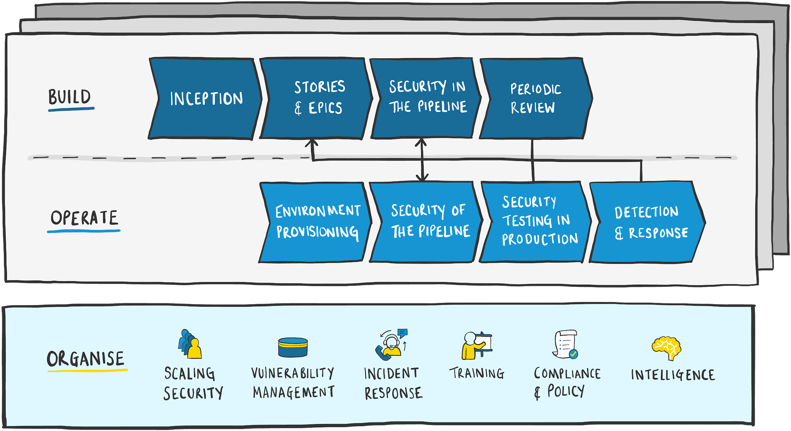

# Practices

The practices in this guide have been divided into three areas: Organise, Build & Operate.

**Organise** practices are owned by Security Engineering and provide a wider view of security across the organisation. They do this by providing specialist expertise and services that can be consumed by the rest of the organisation.

**Build** and **Operate** practices are owned by the product delivery team and focus on security activities during development and live operations of the product.

## Where do I start?

The best approach is to start with the practices that have high impact and low effort.

**Impact:** To understand the impact of a practice, we need a high level view of the context of the product. This includes: what value the product brings to the company, the sensitivity of data the product handles, the impact of a breach or compromise to the product and any regulatory requirements that must be met.

**Effort:** To understand the effort of a practice, we must understand the context of the product delivery. This includes: the technologies used in the product, the delivery team's skill and experience, the level of automation in the deployment pipeline and other teams involved in the delivery process \(e.g. change control\).

The best approach is to deliver the practices in the smallest possible incremental steps that provide immediate feedback. This approach provides immediate measurable value and is also useful to build confidence and demonstrate how improvements can be easily delivered without large expense.

